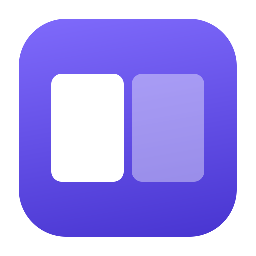

<div align="center">



# Lens

**The keyboard-driven window manager that remembers.**
Spectacle's shortcuts, native on Apple silicon — and your windows come back when you redock.

`macOS 14+` · `Swift 6` · `Apple silicon` · `no network access` · `MIT`

</div>

---

## What makes it different

- **Your windows come back when you redock.** Lens remembers where every window sat in each
  display setup and restores it automatically when that setup returns — no layouts to define,
  no shortcut to press. ([Layout memory](#layout-memory))
- **Undo for window moves.** Every window keeps its own undo/redo history, several steps deep,
  instead of a single "restore".
- **Spectacle muscle memory, day one.** All eighteen Spectacle actions with identical default
  shortcuts, plus 14 more.
- **Small, private, readable.** Native Swift 6, no network access, no analytics, and a geometry
  core with 67 unit tests that you can read in an afternoon.

How it compares with Rectangle, Rectangle Pro, Moom, and macOS tiling:
[Alternatives](#alternatives).

## Contents

- [What makes it different](#what-makes-it-different)
- [Why this exists](#why-this-exists)
- [Project status](#project-status)
- [Features](#features)
- [Default shortcuts](#default-shortcuts)
- [Installing](#installing)
- [Granting Accessibility access](#granting-accessibility-access)
- [Configuration](#configuration)
  - [Layout memory](#layout-memory)
- [Privacy and security](#privacy-and-security)
- [Architecture](#architecture)
- [Why window management on macOS is harder than it looks](#why-window-management-on-macos-is-harder-than-it-looks)
- [Troubleshooting](#troubleshooting)
- [Development](#development)
- [Migrating from Spectacle](#migrating-from-spectacle)
- [Alternatives](#alternatives)
- [Contributing](#contributing)
- [License](#license)

---

## Why this exists

Spectacle was archived by its author in 2018. The last release, 1.2, is an **x86_64-only binary**,
so on Apple silicon it runs under Rosetta 2 — a translation layer Apple has been steadily winding
down. It still works, but it is unmaintained software running through a deprecated compatibility
shim, and it has no idea that Stage Manager, notched displays, or the system tiling added in
recent macOS versions exist.

Lens is a native arm64 rewrite. It reproduces all eighteen of Spectacle's actions with **identical
default shortcuts**, so existing muscle memory transfers on day one, and adds the things fifteen
years of macOS changes made necessary.

The biggest of those is docking. A laptop that moves between a desk with monitors and a sofa
without them loses its window arrangement every time: macOS piles everything onto the remaining
screen and never puts it back. Lens does.

## Project status

**Working, but young. Treat it as beta.**

Confirmed on real hardware: tiling, resizing, and moving windows between displays on a
two-monitor Apple silicon setup, running continuously for days without a crash or leak.

The geometry layer is thoroughly unit-tested — 67 tests across 12 suites, covering every action
against several display configurations including negative-origin and stacked arrangements. That
layer is pure, so the tests need no permissions, no display hardware, and no running apps.

What is *not* systematically verified is the long tail of applications. The Accessibility API is
where macOS window management gets strange, and every app is entitled to be strange in its own
way. The known-awkward cases — Terminal's character-cell sizing, Chrome's enhanced-UI attribute,
fullscreen windows, fixed-size dialogs — each have deliberate handling
([details](#why-window-management-on-macos-is-harder-than-it-looks)), but "handled in code" and
"verified against that app on your machine" are different claims and only the first is true for
most of them.

If something misbehaves, please open an issue with the app name and what you expected — that long
tail is exactly what needs reports to shorten.

If you want something battle-tested today, use [Rectangle](https://rectangleapp.com) — see
[Alternatives](#alternatives).

## Features

Everything Spectacle did:

- Halves, quarters, thirds, centre, and fullscreen
- Move windows between displays
- Undo and redo
- Grow and shrink the focused window
- Menu bar item, launch at login, fully rebindable shortcuts

Plus:

- **Windows come back when you redock.** Unplug a monitor and macOS piles everything onto the
  remaining display; plug it back in and it leaves them piled. Lens remembers the arrangement for
  each display setup and restores it automatically. See
  [Layout memory](#layout-memory).
- **Repeated presses do something useful.** Press `⌥⌘←` again and the window carries on to the
  display on your left, landing against its right edge — Spectacle's behaviour. On a single
  display it cycles ½ → ⅓ → ⅔ instead. Configurable, including "off".
- **Per-window undo history**, rather than one global last action.
- **Gaps** between windows and around screen edges.
- **Per-app exclusions** for anything that manages its own geometry.
- **Sixths, two-thirds, maximize-height/width, almost-maximize** — 14 extra actions, unbound by
  default, ready to assign.
- **JSON import/export** of your whole configuration.
- **Stage Manager aware** — reserves space for the strip, which macOS does not do for you.

32 actions in total.

## Default shortcuts

Exactly Spectacle 1.2's defaults:

| Action | Shortcut | | Action | Shortcut |
| ------------- | -------- |---| ---------------- | -------- |
| Center        | `⌥⌘C`    | | Next Display     | `⌃⌥⌘→`   |
| Fullscreen    | `⌥⌘F`    | | Previous Display | `⌃⌥⌘←`   |
| Left Half     | `⌥⌘←`    | | Next Third       | `⌃⌥→`    |
| Right Half    | `⌥⌘→`    | | Previous Third   | `⌃⌥←`    |
| Top Half      | `⌥⌘↑`    | | Make Larger      | `⌃⌥⇧→`   |
| Bottom Half   | `⌥⌘↓`    | | Make Smaller     | `⌃⌥⇧←`   |
| Upper Left    | `⌃⌘←`    | | Undo             | `⌥⌘Z`    |
| Lower Left    | `⌃⇧⌘←`   | | Redo             | `⌥⇧⌘Z`   |
| Upper Right   | `⌃⌘→`    | |                  |          |
| Lower Right   | `⌃⇧⌘→`   | |                  |          |

The other 14 actions — First/Center/Last Third, First/Last Two Thirds, the six sixths, Maximize
Height, Maximize Width, and Almost Maximize — ship unbound. Assign them under **Settings →
Shortcuts → Additional actions**.

## Installing

### Requirements

- macOS 14 (Sonoma) or later
- Apple silicon (the build targets `arm64`; see [Intel](#intel-macs) below)
- Xcode 16 or newer. The Command Line Tools alone are not enough: recent SDKs implement SwiftUI's
  `@State` as a macro, and its compiler plugin ships only with Xcode.

There are no prebuilt releases yet. Both routes below build from source on your Mac.

### Homebrew

```sh
brew install surfer1225/tap/lens-window-manager
```

The formula builds Lens from the tagged source, with the dependency pinned to a verified commit,
and installs `Lens.app` into Homebrew's prefix. Link it into Applications so Spotlight and
Launchpad find it:

```sh
ln -sf "$(brew --prefix lens-window-manager)/Lens.app" ~/Applications/Lens.app
```

Because it is built locally, it is never quarantined, so Gatekeeper does not prompt. It is still
ad-hoc signed (see [Code signing](#code-signing)), so after each `brew upgrade` macOS asks for
Accessibility access again.

(The formula is named `lens-window-manager` because `lens` is already taken in Homebrew by the
Kubernetes IDE.)

### Build and install

```sh
git clone https://github.com/surfer1225/lens.git
cd lens
make test       # unit tests — no permissions needed
make install    # build, sign, copy to /Applications, launch
```

`make install` writes to `/Applications`, which on macOS 14+ requires your terminal to hold **App
Management** permission (System Settings → Privacy & Security → App Management). If it fails with
`Operation not permitted`, use the disk image instead:

```sh
make package --dmg     # or: bash Scripts/package.sh --dmg
```

then open `~/.cache/lens-build/Lens.dmg` and drag Lens across in Finder. Finder always has the
entitlement; terminals do not.

### If SwiftPM will not run

SwiftPM compiles `Package.swift` into a helper binary and **executes** it to read the manifest. On
machines with binary authorisation software (such as Google's [Santa](https://github.com/google/santa)
in lockdown mode), that helper is not allowlisted, so every
`swift build` fails with:

```
error: Invalid manifest ... Missing or empty JSON output
```

before a line of Lens is compiled. `Scripts/package.sh` sidesteps this by driving `swiftc`
directly — compiling and linking never executes the output:

```sh
make package           # build + sign, no SwiftPM
make package-install   # ...and install
```

It fetches the one dependency with `git`, pins it to a verified commit, builds the four modules in
order, hand-rolls the resource bundle SwiftPM would generate, then assembles and signs the bundle.

### Code signing

Builds are **ad-hoc signed** by default so the project works with zero setup. The cost: an ad-hoc
signature produces a new code hash on every build, and macOS revokes the Accessibility grant
whenever the hash changes — so you re-approve after each reinstall.

If you have a certificate, pass it and the grant persists:

```sh
make identities        # list what you have
make install IDENTITY="Developer ID Application: Your Name (TEAMID1234)"
```

Verify any certificate actually works before relying on it — `spctl -a -vv -t exec <app>`
reporting `CSSMERR_TP_CERT_REVOKED` means macOS will refuse to run the result at all.

### Intel Macs

The build targets `arm64-apple-macos14.0`. For Intel, change `DEPLOYMENT_TARGET` in
`Scripts/package.sh` to `x86_64-apple-macos14.0`, or build a universal binary with two
compile passes and `lipo`. Untested — reports welcome.

## Granting Accessibility access

Lens moves other applications' windows through the Accessibility API, which requires your explicit
permission. On first launch it asks, and points you at the right pane.

**System Settings → Privacy & Security → Accessibility → enable Lens.**

Shortcuts start working the moment you grant it — Lens polls for the change, so there is no need
to relaunch.

If Lens is not in that list, click **+**, press `⇧⌘G`, and navigate to where you installed it.

Hotkeys are registered whether or not permission has been granted. Pressing one before you grant
access **beeps**, which tells you Lens is alive and only needs permission. Without that, the
keystroke would silently fall through to whatever app is in front — where `⌥⌘←` means "previous
tab" in most browsers, and the app looks broken for no visible reason.

## Configuration

Open **Settings** from the menu bar item (`⌘,`).

### Shortcuts

Every action is rebindable, laid out in the same two columns Spectacle used. **Restore Defaults**
puts everything back.

### General

| Setting | Default | What it does |
| --- | --- | --- |
| Launch at login | off | Registers via `SMAppService`. Needs the app in `/Applications` or `~/Applications`, not a temporary folder. |
| Pressing a shortcut again | Move to next display | See below. |
| Screen edges | 0 pt | Gap between windows and the screen edge. |
| Between windows | 0 pt | Total gap between two adjacent windows; each gives up half. |
| Make Larger/Smaller step | 30 pt | Points added or removed per side. |
| Leave fullscreen before moving | on | macOS ignores geometry changes on fullscreen windows, so without this those shortcuts appear to do nothing. |
| Reserve space for Stage Manager | 64 pt | Only applied when Stage Manager is actually on. |

### Repeated presses

Three modes:

- **Move to next display** (default) — Spectacle's behaviour. First press puts the window on the
  left half; the second carries it to the display on the left, landing on that display's *right*
  half so it stays adjacent to where it came from. It does not wrap: on your leftmost display it
  falls back to cycling sizes, so the setting is still useful with one monitor.
- **Cycle through sizes** — ½ → ⅓ → ⅔, never leaving the current display.
- **Do nothing new** — every press applies the same frame. Byte-exact Spectacle 1.2.

Cycling is timer-free. A press only counts as a repeat if the window is still exactly where Lens
put it, so a long pause still continues the cycle, but any manual resize starts over. That is more
predictable than a timeout and needs no clock.

### Layout memory

macOS does not restore window positions when your displays change. Unplug a monitor and
everything lands on the laptop screen; plug it back in and it stays there. Lens fixes this.

While your displays stay the same, Lens records where every window sits, roughly every 30
seconds, keyed by a **fingerprint** of the current arrangement — the displays' names,
resolutions, and relative positions. "Laptop alone", "laptop at the office", and "laptop plus two
monitors at home" are three separate setups, each remembering its own layout.

When the display configuration changes, Lens waits for it to settle, looks up whatever it last
recorded for the setup you have just arrived at, and puts the windows back.

Matching a remembered window to a live one runs in two passes: exact window title first, so a
reopened app lands correctly even if it restored its windows in a different order, then by
position for untitled windows and apps that reuse a title. Anything unmatched is left strictly
alone — a window Lens does not recognise is never moved, and a remembered window whose app is not
running is simply dropped.

Because the fingerprint includes resolution and arrangement, a remembered frame can only ever be
applied to the exact geometry it was captured on. Changing a display's resolution creates a new
setup rather than reusing stale coordinates.

Controls live in the menu bar and under **Settings → General → Layouts**. Note that the record
updates continuously, so *Update Remembered Layout* refreshes the running record rather than
pinning a permanent snapshot.

Turn the whole thing off with **Restore window layout when displays change**.

### Exclusions

Bundle identifiers Lens refuses to touch — useful for virtual machines, games, and anything that
manages its own geometry. Add from a list of running apps.

### Import and export

**General → Configuration** writes your settings as JSON. The file contains your gaps, resize
step, display and fullscreen preferences, and the bundle identifiers of excluded apps. Nothing
else. Keyboard shortcuts are stored separately by the shortcut recorder and are not included.

## Privacy and security

Lens is a local utility. Concretely:

- **No network access whatsoever.** There is no `URLSession`, no analytics, no crash reporting, no
  update check, and no server of any kind. Verify with
  `grep -rE 'URLSession|http' Sources/`.
- **No subprocess execution.** Lens never shells out.
- **No credentials, keychain access, or file scanning.**
- **What it stores:** one JSON blob in `UserDefaults` under `dev.lens.Lens` (your settings), plus
  the shortcut bindings the recorder keeps. That's all.
- **What it reads:** window position and size of the frontmost app's focused window, the list of
  running applications (to populate the exclusions picker), and
  `com.apple.WindowManager`'s `GloballyEnabled` flag to detect Stage Manager.

### It is not sandboxed, deliberately

`Resources/Lens.entitlements` disables the App Sandbox. This is not laziness — **a sandboxed
process cannot drive another application's windows through the Accessibility API**. Every window
manager on macOS has to make this trade. It is also why Lens cannot ship on the Mac App Store.

Accessibility access is powerful: an app holding it can read and control other applications' UI.
Grant it only to software you trust and can inspect. That is a good reason to build this yourself
from source rather than taking a binary from a stranger.

### Private API disclosure

Lens uses one private symbol: **`_AXUIElementGetWindow`**, which maps an `AXUIElement` to a
`CGWindowID`. Apple has never made it public, and there is no supported alternative. It is needed
to tell two windows of the same app apart, which drives per-window undo history and repeat
detection.

It is resolved at runtime via `dlsym` rather than linked, so a future macOS that removes it
degrades gracefully instead of failing to launch: Lens falls back to hashing the process ID and
window title, marks that identity as inexact, and disables repeat-cycling for it — because two
untitled windows of one app would otherwise collide and cycle each other's sizes.

Every other private-ish thing Lens touches is an undocumented **attribute string**, not a private
function: `AXEnhancedUserInterface` and `AXFullScreen`. Both are widely used, read defensively,
and safe to be absent.

**If you plan to ship anything based on this to the App Store, the private symbol will get you
rejected.** Delete `PrivateAX` and accept the fallback.

### Supply chain

One dependency: [KeyboardShortcuts](https://github.com/sindresorhus/KeyboardShortcuts) by Sindre
Sorhus, MIT licensed. `Scripts/package.sh` pins it to commit
`70caa8dea43e2d273cd5ab78885d7eff01df550c` (tag `v1.10.0`) and **verifies the commit after
cloning**, refusing to build on a mismatch — tags are mutable, commits are not.

`Package.resolved` is deliberately *not* in `.gitignore`, so the SwiftPM path pins the same way
once you have run a build and committed it.

## Architecture

Three targets, split so the fiddly part is testable without granting anything:

| Target | Contents |
| --- | --- |
| `LensCore` | Pure geometry and settings. No AppKit, no Accessibility, no I/O. Fully unit-tested. |
| `LensAX` | The Accessibility and `NSScreen` boundary — coordinate flips, screen ordering, the resize dance. |
| `Lens` | The app: menu bar item, Settings UI, global hotkeys. |

```
Sources/
├── LensCore/          # pure — 45 tests run against this alone
│   ├── WindowAction.swift    32 actions, edge-crossing and mirroring rules
│   ├── RectCalculator.swift  (action, window, screen, cycle, gaps) -> CGRect
│   ├── UnitRect.swift        layouts as fractions, so one table fits every screen size
│   ├── CycleState.swift      timer-free repeat detection
│   ├── Gaps.swift            outer/inner padding
│   └── Settings.swift        Codable, lenient decoding
├── LensAX/            # everything that touches other apps
│   ├── AXElement.swift            typed wrappers over the C API, plus the dlsym shim
│   ├── AXApplication.swift        frontmost app, enhanced-UI toggle
│   ├── AXWindow.swift             frame get/set, fullscreen, identity
│   ├── ScreenDetector.swift       coordinate flip, screen ordering, adjacency
│   └── AccessibilityAuthorizer.swift
└── Lens/              # the app
    ├── LensApp.swift, AppModel.swift, ActionDispatcher.swift
    ├── Shortcuts.swift, UndoStore.swift, LaunchAtLogin.swift
    └── UI/
```

`LensCore` takes and returns `CGRect`s in Cocoa orientation (origin bottom-left) and knows nothing
about displays. `LensAX` owns the conversion to the Accessibility API's top-left space. That split
is why the geometry can be tested exhaustively with no permissions, no display hardware, and no
running apps.

Global hotkeys come from KeyboardShortcuts, which wraps Carbon's `RegisterEventHotKey` — still the
only supported way to *consume* a global key combination. `NSEvent.addGlobalMonitorForEvents` can
observe but not swallow, so the keystroke would also reach the frontmost app.

## Why window management on macOS is harder than it looks

Each of these is handled in `LensAX`, and each is why a naive implementation works on Safari and
nothing else. If you are writing your own, this list is the interesting part of the repo.

1. **Two coordinate systems.** Accessibility measures from the top-left of the *primary* screen
   with y growing downward; Cocoa measures from the bottom-left with y growing up. The anchor must
   be the screen at origin `(0,0)` — **not** `NSScreen.main`, which is wherever focus happens to
   be and will silently corrupt multi-display maths.

2. **Character-cell sizing.** Terminal and iTerm only accept sizes that are a whole number of
   character cells. Lens sets size, then position, then size again, then repositions if the app
   settled on something else.

3. **`AXEnhancedUserInterface`.** Chrome, Electron apps, and anything with VoiceOver-style
   enhanced UI mis-apply or slowly animate geometry changes while this application-level attribute
   is on. Lens switches it off around the move and **always restores it** via `defer` — leaving it
   off would quietly degrade VoiceOver for that app.

4. **Fullscreen windows ignore geometry changes.** Set a frame on one and nothing happens, with no
   error. Lens leaves fullscreen first and waits for the animation to finish.

5. **Stage Manager's strip is not excluded from `visibleFrame`.** There is no API for it, so Lens
   reads `com.apple.WindowManager`'s `GloballyEnabled` default and reserves the space itself.

6. **`visibleFrame`, the notch, and the menu bar.** `visibleFrame` already excludes the menu bar
   and Dock; `safeAreaInsets` matters when the menu bar is auto-hidden on notched displays.

7. **Recent macOS ships its own tiling**, with margins configurable under Desktop & Dock. Lens's
   keyboard path does not trigger it, but the gap settings let you match its look.

8. **Window identity.** Cycling and undo need a stable key per window, which is what forces the
   private symbol discussed above.

9. **Display order is arbitrary.** `NSScreen.screens` reflects registration order, not physical
   arrangement, so Next/Previous Display would jump around. Lens sorts by position, and adjacency
   checks perpendicular overlap so a display stacked *above* yours is never treated as being to
   its left.

10. **Not every window is yours to move.** System dialogs and fixed-size panels are filtered on
    settability and AX subrole.

## Troubleshooting

**Shortcuts do nothing, no beep.** Another app owns the hotkey. Carbon registration is
first-come-first-served, so if Spectacle, Rectangle, Magnet, or similar is running, Lens never
gets the combination. Quit the other one.

**Shortcuts beep.** Lens is running and owns the hotkey but lacks Accessibility permission. See
[above](#granting-accessibility-access).

**`⌥⌘←` changes browser tabs.** The hotkey is not registered, so the keystroke is reaching the app
instead. Same cause as the first case.

**Accessibility keeps being revoked after rebuilds.** Expected with ad-hoc signing — the code hash
changes every build. Sign with a stable identity.

**Terminal ends up a few pixels off.** Character-cell quantisation. Lens keeps the window
on-screen but cannot make it exactly half a screen wide.

**Nothing happens on a fullscreen window.** Enable *Leave fullscreen before moving a window*.

**Windows land in the wrong place with Stage Manager on.** Adjust *Reserve space for Stage
Manager*.

**Binary authorisation software blocks it.** On managed Macs running Santa in lockdown mode or
similar, a locally built binary has no allowlist rule and is killed at `exec`. Every rebuild
produces a new hash and needs re-approval, so if you are developing rather than just installing,
ask your admins for a lockdown exemption or for the linker to be registered for transitive
allowlisting.

## Development

```sh
make test         # unit tests (LensCore only — no permissions required)
make build        # debug build via SwiftPM
make package      # build + sign without SwiftPM
make app          # build + sign via SwiftPM
make clean
python3 Scripts/make-icon.py    # regenerate the icon
```

The icon generator uses the standard library only — no Pillow, no drawing framework. Shapes are
rasterised from a signed distance field, PNGs are written by hand with `zlib`, and every iconset
size is rendered natively rather than downsampled, so 16pt stays crisp.

### Adding an action

1. Add a case to `WindowAction` and give it a `title`.
2. Add its layout to `RectCalculator.sequence(for:)` — usually one `UnitRect`.
3. If it pins a window to one side, add it to `crossingEdge` and `mirroredAcrossEdge`.
4. Optionally give it a default in `Shortcuts.defaultShortcut(for:)`.
5. Add a test.

It appears in Settings automatically.

### Testing

`LensCore` is pure, so tests need no permissions, no displays, and no running apps. Run them
anywhere:

```sh
make test
```

`LensAX` and the UI are not unit-tested — they are boundary code whose behaviour lives in other
processes. Changes there need manual checks against the awkward cases: Terminal (cell
quantisation), Chrome (enhanced UI), a fixed-size dialog, a fullscreen window, and a second
display.

## Migrating from Spectacle

Lens registers the same shortcuts, so **run only one at a time** — whichever launches first wins,
and the other silently gets nothing.

```sh
osascript -e 'quit app "Spectacle"'
# confirm Lens responds to all eighteen, then:
rm -rf /Applications/Spectacle.app
defaults delete com.divisiblebyzero.Spectacle
```

Spectacle stored its shortcuts in `~/Library/Preferences/com.divisiblebyzero.Spectacle.plist`.
There is no automatic import — if you customised yours, re-enter them in Settings. If you used the
defaults, there is nothing to do.

## Alternatives

Worth knowing about, honestly. Checked October 2026; corrections welcome.

| | Lens | [Rectangle](https://rectangleapp.com) | [Rectangle Pro](https://rectangleapp.com/pro) | [Moom](https://manytricks.com/moom/) | macOS tiling |
|---|---|---|---|---|---|
| Price | Free | Free | Paid (one-time, 3 Macs) | $15 one-time | Free |
| Open source | Yes (MIT) | Yes (MIT) | No | No | No |
| Restores your arrangement when displays change | **Automatically, no setup** | Not documented | Applies a workspace you define in advance | Saved layouts you trigger | No |
| Undo window moves | **Per-window, multi-step** | Single restore | Not stated | Not stated | No |
| Spectacle default shortcuts | Yes | Yes (preset) | Imports Rectangle's | No | No |
| Halves, thirds, sixths, quarters | Yes | Yes (also ninths, eighths) | Yes, plus custom sizes | Custom | Halves and quarters |
| Repeated press moves to the next display | Yes | Yes (option) | Configurable repeats | Via chains | No |
| Drag to snap | No (keyboard only) | Yes | Yes, custom snap areas | Yes | Yes |
| Network access | None | Update checks | License activation (Paddle) | Not stated | — |

Which to pick:

- **[Rectangle](https://rectangleapp.com)** — the mature, actively maintained Spectacle successor,
  with drag-to-snap and years of app-specific workarounds. The best choice if you mostly work at
  one desk and want the widest app coverage.
- **[Rectangle Pro](https://rectangleapp.com/pro) / [Moom](https://manytricks.com/moom/)** — for
  custom layouts, snap areas, and app workspaces.
- **[yabai](https://github.com/koekeishiya/yabai)** / **[Amethyst](https://ianyh.com/amethyst/)** —
  for automatic tiling. yabai needs SIP partially disabled for some features.
- **macOS built-in tiling** — free and permission-free, but limited to halves and quarters.
- **Lens** — if you move between display setups and want your windows back, want undo for window
  moves, or want something small enough to read and change to taste.

For a feature-by-feature review and the roadmap, see [FEATURES.md](FEATURES.md).

## Contributing

Bug reports naming a specific application are the most useful thing you can send — see
[CONTRIBUTING.md](CONTRIBUTING.md) for the setup, the one architectural rule, and what is
deliberately out of scope. Changes are tracked in [CHANGELOG.md](CHANGELOG.md).

## License

MIT — see [LICENSE](LICENSE). Third-party notices are in
[THIRD-PARTY-NOTICES.md](THIRD-PARTY-NOTICES.md).

## Acknowledgements

- [Spectacle](https://github.com/eczarny/spectacle) by Eric Czarny, for the shortcut layout a lot
  of people still have in their fingers.
- [KeyboardShortcuts](https://github.com/sindresorhus/KeyboardShortcuts) by Sindre Sorhus.
- [Rectangle](https://github.com/rxhanson/Rectangle), whose source documents several of the
  Accessibility workarounds above better than Apple does.
